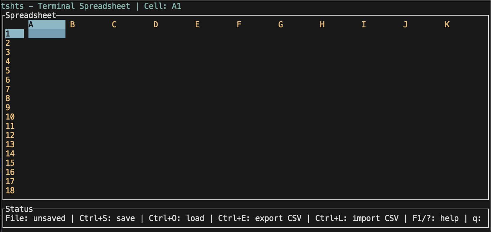

# TSHTS - Terminal Spreadsheet

An efficient, lightweight terminal-based spreadsheet application built in Rust. TSHTS brings the power of spreadsheet calculations to your command line with an intuitive interface, comprehensive formula support, and robust data management capabilities.




## 🚀 Quick Start

### Installation

```bash
# Clone the repository
git clone https://github.com/SamuelSchlesinger/tshts.git
cd tshts

# Build and run
cargo run --release

# Or build for installation
cargo build --release
# Binary will be available at target/release/tshts
```

### First Steps

1. **Navigate**: Use arrow keys or `hjkl` to move between cells
2. **Edit**: Press `Enter` or `F2` to edit a cell
3. **Formula**: Start with `=` for formulas (e.g., `=A1+B1`, `=SUM(A1:A10)`)
4. **Save**: Press `Ctrl+S` to save your spreadsheet as `.tshts` file
5. **Export/Import**: Use `Ctrl+E` for CSV export, `Ctrl+I` for CSV import
6. **Search**: Press `/` to search across all cells and formulas
7. **Help**: Press `F1` or `?` for comprehensive help

## ✨ Key Features

### 🧮 Powerful Formula Engine
- **Multi-Type System**: Full support for both numbers and strings
- **Arithmetic Operations**: `+`, `-`, `*`, `/`, `**` (power), `%` (modulo)
- **String Operations**: `&` (concatenation), string literals with `"quotes"`
- **Comparison Operators**: `<`, `>`, `<=`, `>=`, `=`, `<>` (works with strings and numbers)
- **Numeric Functions**: `SUM`, `AVERAGE`, `MIN`, `MAX`, `ABS`, `SQRT`, `ROUND`
- **String Functions**: `CONCAT`, `LEN`, `UPPER`, `LOWER`, `TRIM`, `LEFT`, `RIGHT`, `MID`, `FIND`
- **Web Functions**: `GET` (fetch content from URLs)
- **Logical Functions**: `IF`, `AND`, `OR`, `NOT` (work with strings and numbers)
- **Cell References**: Standard notation (A1, B2, AA123, etc.)
- **Range Support**: Use ranges like `A1:C3` in functions
- **Circular Reference Detection**: AST-based analysis prevents infinite loops
- **Undo/Redo Support**: Full undo/redo functionality with `Ctrl+Z`/`Ctrl+Y`
- **Cell Range Selection**: Select ranges with `Shift+Arrow` keys
- **Autofill Functionality**: Copy formulas with relative references using `Ctrl+D`

### 📊 Smart Interface
- **Auto-sizing Columns**: Columns automatically adjust to content width
- **Manual Resize**: Use `+` for all columns, `-`/`_` for individual column adjustment
- **Scrolling Viewport**: Navigate large spreadsheets smoothly with automatic cursor tracking
- **Visual Selection**: Clear indication of current cell with range selection support
- **Status Messages**: Real-time feedback for operations and file status
- **Search Highlighting**: Visual highlighting of search results with navigation
- **Multiple View Modes**: Normal, editing, help, file operations, and search modes

### 💾 File Management
- **Native Format**: Human-readable `.tshts` files in JSON format
- **Save/Load**: `Ctrl+S` to save, `Ctrl+O` to load spreadsheet files
- **CSV Support**: `Ctrl+E` to export CSV, `Ctrl+I`/`Ctrl+L` to import CSV
- **Dependency Tracking**: Automatic rebuilding of formula dependencies on load
- **Error Handling**: Graceful handling of file operations with clear error messages
- **Data Integrity**: Preserves formulas, values, column widths, and sheet dimensions

## 🎯 Why Choose TSHTS?

**Performance**: Built in Rust for excellent performance and memory efficiency. Handles large spreadsheets smoothly in terminal environments.

**Portability**: Cross-platform support (Linux, macOS, Windows) with no GUI dependencies. Perfect for servers, remote work, and headless environments.

**Developer-Friendly**: Clean architecture following domain-driven design principles. Comprehensive documentation, extensive test coverage, and modular structure make it easy to extend.

**Modern Workflow**: Git-friendly JSON format, command-line integration, and automation support. Works seamlessly with CI/CD pipelines and version control.

**Rich Feature Set**: Advanced formula engine with web functions (`GET`), string manipulation, logical operations, and mathematical functions. Real-time search, undo/redo, and smart autofill capabilities.

### Current Capabilities

TSHTS provides a comprehensive spreadsheet experience with:

- ✅ **Formula Engine**: Multi-type evaluation (numbers and strings) with 30+ operators and functions
- ✅ **Data Types**: Full support for strings, numbers, formulas, and mixed-type operations
- ✅ **Web Integration**: `GET` function for fetching data from URLs and APIs
- ✅ **String Processing**: Comprehensive text manipulation with `UPPER`, `LOWER`, `TRIM`, `FIND`, `MID`, etc.
- ✅ **Mathematical Functions**: `SUM`, `AVERAGE`, `MIN`, `MAX`, `ABS`, `SQRT`, `ROUND`, and more
- ✅ **Logical Operations**: `IF`, `AND`, `OR`, `NOT` with full boolean logic support
- ✅ **Range Operations**: Support for cell ranges (`A1:C3`) in all applicable functions
- ✅ **File Operations**: Native `.tshts` format and CSV import/export
- ✅ **Smart UI**: Responsive terminal interface with multiple interaction modes
- ✅ **Search System**: Full-text search across cell values and formulas
- ✅ **Undo/Redo**: Complete action history with unlimited undo levels
- ✅ **Selection Tools**: Range selection and autofill with relative reference adjustment
- ✅ **Error Handling**: Circular reference detection and comprehensive error reporting

### Roadmap & Contributing

We're actively developing TSHTS with these upcoming features:

- 📅 **Charts & Visualization**: Basic terminal-based charts
- 📅 **Import/Export**: CSV, Excel format support
- 📅 **Scripting**: Lua/Python integration for custom functions
- 📅 **Collaboration**: Real-time sharing capabilities
- 📅 **Plugins**: Extension system for custom functionality

**Want to contribute?** Check our [issues](https://github.com/SamuelSchlesinger/tshts/issues) for good first contributions. We welcome:
- Bug reports and feature requests
- Documentation improvements
- Performance optimizations
- New formula functions
- Platform-specific enhancements

## 📖 Comprehensive Formula Reference

TSHTS supports a powerful multi-type formula system that handles both numbers and strings seamlessly.

### 🔢 Numeric Operations

#### Basic Arithmetic
```
=2+3          → 5
=10-4         → 6
=A1*B1        → Multiplies values in A1 and B1
=15/3         → 5
=2**3         → 8 (2 to the power of 3)
=10%3         → 1 (10 modulo 3)
```

#### Numeric Functions
```
=SUM(A1,B1,C1)        → Sum of individual cells
=SUM(A1:A10)          → Sum of range A1 through A10
=AVERAGE(A1:A10)      → Average of range
=MIN(A1:C3)           → Minimum value in range
=MAX(A1:C3)           → Maximum value in range
=ABS(-5)              → 5 (absolute value)
=SQRT(16)             → 4 (square root)
=ROUND(3.14159)       → 3 (round to integer)
=ROUND(3.14159, 2)    → 3.14 (round to 2 decimal places)
```

### 🔤 String Operations

#### String Literals and Concatenation
```
="Hello World"        → Hello World
=""                   → (empty string)
="Hello" & " " & "World"  → Hello World
="Number: " & 42      → Number: 42
="Result: " & (2+3)   → Result: 5
```

#### String Functions
```
=LEN("Hello")         → 5 (string length)
=UPPER("hello")       → HELLO (convert to uppercase)
=LOWER("WORLD")       → world (convert to lowercase)
=TRIM("  spaces  ")   → spaces (remove leading/trailing spaces)
```

#### String Extraction (1-based, Excel-compatible)
```
=LEFT("Hello World", 5)    → Hello (first 5 characters)
=RIGHT("Hello World", 5)   → World (last 5 characters)
=MID("Hello World", 7, 5)  → World (5 chars starting at position 7)
=FIND("lo", "Hello")       → 4 (case-sensitive; 'l' of "lo" is at position 4)
=FIND("World", "Hello World")  → 7
=SEARCH("WORLD", "Hello World") → 7 (case-insensitive FIND)
```

#### Advanced String Operations
```
=CONCAT("A", "B", "C")      → ABC (concatenate multiple values)
=CONCAT("Number: ", 123)    → Number: 123
=FIND("text", A1, 4)        → Find "text" in A1 starting from position 4
```

### 🌐 Web Functions
```
=GET("https://api.example.com/data")     → Fetch raw content from API
=GET("https://jsonplaceholder.typicode.com/posts/1") → Get JSON data
=GET("https://raw.githubusercontent.com/user/repo/main/data.csv") → Fetch CSV
=LEN(GET("https://example.com"))         → Get length of web content
=UPPER(GET("https://api.service.com"))   → Convert fetched content to uppercase
```

### 🔍 Comparisons (Work with Numbers and Strings)
```
=5<10             → 1 (true)
=A1>=B1           → 1 if A1 ≥ B1, 0 otherwise
="Hello"="Hello"  → 1 (string equality)
="Hello"<>"World" → 1 (string inequality)
=A1<>B1           → 1 if values are different
```

### 🧠 Logical Functions
```
=IF(A1>10, "High", "Low")     → Conditional with string results
=IF(A1="Hello", "Found", "Not Found")  → String condition
=AND(A1>0, B1<10)             → 1 if both conditions true
=OR(A1=0, B1=0)               → 1 if either condition true
=NOT(A1>5)                    → 1 if A1 ≤ 5
```

### 📊 Cell References and Ranges
```
=A1               → Value from cell A1 (auto-detects number vs string)
=A1+B1            → Sum if numeric, concatenation if mixed types
=SUM(A1:A10)      → Sum of range A1 through A10
=AVERAGE(B1:B5)   → Average of range B1 through B5
=CONCAT(A1:A3)    → Concatenate all values in range A1:A3
```

#### Absolute vs Relative References
Use `$` to lock a component so it doesn't shift when the formula is copied,
pasted, or when rows/columns are inserted.
```
=A1               → fully relative (both row and column shift)
=$A1              → column A is locked, row shifts
=A$1              → row 1 is locked, column shifts
=$A$1             → both locked — always the same cell
=SUM($A$1:B2)     → mix of absolute and relative in a range
```

### 🔄 Type Conversion
TSHTS automatically handles type conversion:
- **Numeric operations**: Strings are converted to numbers (empty/invalid = 0)
- **String operations**: Numbers are converted to strings
- **Comparisons**: Like types compared directly, mixed types compared as strings
- **Cell values**: Auto-detected based on content

### 📝 Formula Examples

#### Data Processing
```
=UPPER(A1) & " - " & LOWER(B1)           → Combine formatted strings
=IF(LEN(A1)>0, A1, "Empty")              → Check for non-empty strings
=LEFT(A1, FIND(" ", A1)-1)               → Extract first word
=MID(A1, FIND(" ", A1)+1, LEN(A1))      → Extract everything after first space
```

#### Data Validation
```
=IF(AND(LEN(A1)>3, A1<>""), "Valid", "Invalid")  → Validate string length
=IF(OR(A1="", A1="N/A"), "Missing", A1)          → Handle missing data
```

#### Complex Calculations
```
=SUM(A1:A10) & " total items"            → Numeric result with description
=IF(AVERAGE(A1:A10)>50, "PASS", "FAIL")  → Grade based on average
=CONCAT("Hello ", A1, ", you scored ", B1, "%")  → Dynamic messages
```

### ⚠️ Important Notes

- **String Indexing**: String functions use 1-based Excel-compatible indexing (position 1 is the first character)
- **Case Sensitivity**: String comparisons and `FIND` are case-sensitive; use `SEARCH` for case-insensitive matching
- **Error Handling**: Invalid operations return `#ERROR`
- **Empty Strings**: `""` is considered different from empty cells
- **Quotes in Strings**: Use double quotes to escape: `"Quote""Test"` → `Quote"Test`

## ⌨️ Keyboard Shortcuts

### Navigation
- **Arrow Keys** / **hjkl**: Move cell selection
- **Page Up/Down**: Fast scrolling
- **Home**: Jump to cell A1

### Editing
- **Enter** / **F2**: Start editing current cell
- **Esc**: Cancel editing
- **Enter**: Confirm editing

### File Operations
- **Ctrl+S**: Save spreadsheet
- **Ctrl+O**: Load spreadsheet
- **q**: Quit application (in normal mode)

### View
- **F1** / **?**: Show/hide help
- **=**: Auto-resize current column
- **+**: Auto-resize all columns
- **-** / **_**: Manually adjust column width

## 🔧 Configuration

TSHTS uses sensible defaults but can be customized:

### Default Settings
- **Grid Size**: 100 rows × 26 columns
- **Column Width**: 8 characters (auto-adjusting)
- **File Format**: JSON (.tshts extension)
- **Default Filename**: `spreadsheet.tshts`

### File Format
TSHTS saves files in a clean JSON format that's both human-readable and version-control friendly:

```json
{
  "cells": [
    [0, 0, {"value": "Hello", "formula": null}],
    [1, 1, {"value": "42", "formula": "=6*7"}]
  ],
  "rows": 100,
  "cols": 26,
  "column_widths": {"0": 15},
  "default_column_width": 8
}
```

## 🏗️ Architecture

TSHTS follows clean architecture and domain-driven design principles:

```
src/
├── domain/          # Core business logic (no external dependencies)
│   ├── models.rs    # Data structures (Spreadsheet, CellData)
│   ├── services.rs  # Formula evaluation engine and CSV operations
│   └── parser.rs    # Expression parser with formal BNF grammar
├── application/     # Application orchestration
│   └── state.rs     # App state, modes, and business workflows
├── infrastructure/  # External integrations
│   └── persistence.rs # File I/O operations and serialization
├── presentation/    # User interface layer
│   ├── ui.rs        # Terminal rendering with ratatui
│   └── input.rs     # Keyboard input handling and event processing
├── lib.rs           # Library interface
└── main.rs          # Application entry point
```

### Design Benefits

This modular architecture provides:
- **Testable**: Each layer has comprehensive unit and integration tests
- **Maintainable**: Clear separation of concerns with well-defined interfaces
- **Extensible**: Easy to add new functions, operators, and features
- **Portable**: Domain logic is UI-framework independent
- **Type-Safe**: Leverages Rust's type system for reliability
- **Documentation**: Extensive rustdoc comments throughout the codebase

## 🧪 Testing

TSHTS has comprehensive test coverage:

```bash
# Run all tests
cargo test

# Run with coverage
cargo test --release

# Run specific test modules
cargo test domain::
cargo test formula_evaluator
```

Test categories:
- **Unit Tests**: Individual component functionality
- **Integration Tests**: File I/O and persistence
- **Formula Tests**: Expression evaluation correctness
- **UI Tests**: Application state management

## 📋 System Requirements

- **Operating System**: Linux, macOS, Windows (anywhere Rust runs)
- **Terminal**: Any terminal with ANSI color and cursor support
- **Rust**: 1.70+ with 2024 edition support (for building from source)
- **Memory**: Minimal footprint (~10MB typical usage)
- **Storage**: Lightweight JSON files (typically <1MB for large sheets)
- **Dependencies**: Pure Rust implementation with minimal external dependencies

## 🤝 Getting Help

- **In-App Help**: Press `F1` or `?` for comprehensive help with scrollable documentation
- **Issues**: [GitHub Issues](https://github.com/SamuelSchlesinger/tshts/issues)
- **Discussions**: [GitHub Discussions](https://github.com/SamuelSchlesinger/tshts/discussions)
- **Documentation**: This README and extensive rustdoc documentation (`cargo doc --open`)
- **Examples**: Sample `.tshts` files and formula examples in the repository

## 📜 License

MIT License - see [LICENSE](LICENSE) file for details.

## 🙏 Acknowledgments

Built with:
- [Ratatui](https://github.com/ratatui-org/ratatui) - Terminal UI framework
- [Crossterm](https://github.com/crossterm-rs/crossterm) - Cross-platform terminal manipulation
- [Serde](https://github.com/serde-rs/serde) - Serialization framework

Special thanks to the Rust community for creating an ecosystem that makes building fast, reliable terminal applications a joy.

---

**Ready to supercharge your terminal workflow?** Give TSHTS a try and experience the power of spreadsheets without leaving your command line!
